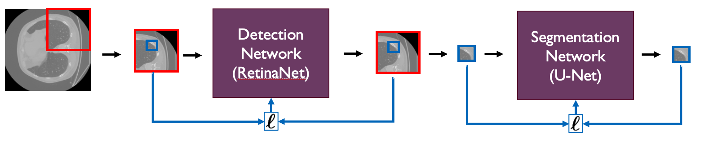

# A Two-Stage Deep Learning Pipeline For Rib Fracture Detection

We introduce a two-stage pipeline for the RibFrac challenge, automating rib fracture detection and segmentation in CT scans. Our method combines a 3D Retinanet for initial detection and a U-net for precise segmentation. We address challenges in training the Retinanet, emphasizing anchor box optimization, class imbalance, and input patching. When we assess both networks within the two-stage framework, we observe that issues encountered during Retinanet training have a detrimental effect on the performance of the U-net. However, when isolating the U-net, we present qualitative results for the U-net, underscoring the potential of our two-step approach. Future work includes addressing optimization challenges and exploring false positive detection networks.

<p float="left" align="middle">
  
</p>

## Setup
### Installation instructions
Install and activate the conda environment.
```
conda create -n ribfrac python=3.7
conda activate ribfrac
```

### Download data
We provide a tiny dataset [data_dev](https://drive.google.com/file/d/16EH9XhdXvnVeiIzUDGEyjd1DuxIDXxAQ/view?usp=sharing) (444 MB), which can be used for quick development. To be saved in the project directoty as `data_dev/` Furthermore, it is used in `notebooks/` to highlight the key components of our pipeline. 

To download the competition data, you can download the competition data by first [Join](https://ribfrac.grand-challenge.org/participants/registration/create/) the challenge then visit the [Dataset](https://ribfrac.grand-challenge.org/dataset/) page. We also provide a script that downloads all the data, which can be found in `jobs/`.

### How to run
```
# Preprocess the data
python preprocess.py --split val
python preprocess.py --split train
python preprocess.py --split test

# Run the detection network, the retinanet
python run.py --train   --net retinanet --dataset patches --version run0
python run.py --predict --net retinanet --dataset patches --version run0

# Run the segmentation network, the 3D U-Net
python run.py --train   --net unet3d --dataset boxes
python run.py --train   --net unet3d --dataset boxes --data_dir ../logs/retinanet/run0 --version run0 --splits train val
python run.py --predict --net unet3d --dataset boxes --data_dir ../logs/retinanet/run0  --version run0 --splits test
```

## Code structure
- `jobs/` Bash scripts to download data.
- `notebooks/` Notebooks that showcases how the networks can be trained.
- `ribfrac/` Contains RibFrac challenge evaluation scripts. Found from: [MICCAI 2020 RibFrac Challenge](https://ribfrac.grand-challenge.org/).
- `src/` Source code of our implemenation

## Contact
If you have questions or found a bug, send a email to [eliasdubbeldam@gmail.com](mailto:eliasdubbeldam@gmail.com)
