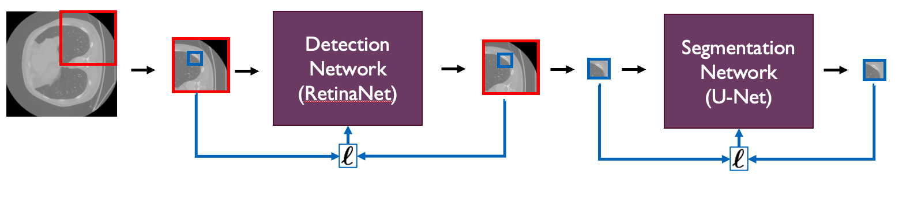

# A Two-Stage Deep Learning Pipeline For Rib Fracture Detection

We introduce a two-stage pipeline for the RibFrac challenge, automating rib fracture detection and segmentation in CT scans. Our method combines a 3D Retinanet for initial detection and a U-net for precise segmentation. We address challenges in training the Retinanet, emphasizing anchor box optimization, class imbalance, and input patching. When we assess both networks within the two-stage framework, we observe that issues encountered during Retinanet training have a detrimental effect on the performance of the U-net. However, when isolating the U-net, we present qualitative results for the U-net, underscoring the potential of our two-step approach. Future work includes addressing optimization challenges and exploring false positive detection networks.

<p float="left" align="middle">
  
</p>

## Installation instructions
Install and activate the conda environment.
```
conda env create -f env_nli.yml
conda activate nli2
```

Install SentEval inside the NLI repository
```
# Clone repo from FAIR GitHub
git clone https://github.com/facebookresearch/SentEval.git
cd SentEval/
cp ../nli/senteval_utils.py senteval/utils.py # see comment below

# Install sentevall and download transfer datasets
python setup.py install 
cd data/downstream/
./get_transfer_data.bash
cd ../../.. # Go back to main dir
```
Comment about `cp ... senteval/utils.py`: Because we pass some extra arguments to the `batcher` function in SentEval, we have to comment out a check that doesn't allow custom arguments being passed. That is, line `89 - 93` from `/SentEval/senteval/utils.py` are commented out.

Downloading and preprocessing SNLI, downloading GloVe and creating the vocabulary can all be done at once. The vocabulary can also be downloaded [here](https://drive.google.com/file/d/1syMGFLZimX5SBFVh3bxpRiGdVV9Bc8q6/view?usp=sharing) (47 MB pickle file), in that case flag `--create_vocab` can be omitted. Default directory is `store/vocab.pkl`. 
```
python nli/preprocess.py --download_snli --download_glove --create_vocab
```

## Code structure
- `jobs/` scripts to send jobs to Snellius.
- `logs/` Contains trained models and related data such as checkpoints.
- `notebooks/` Contains several experimental notebooks for data exploration, model evaluation and processing.
- `ribfrac/` Contains RibFrac challenge evaluation scripts. Found from: [MICCAI 2020 RibFrac Challenge](https://ribfrac.grand-challenge.org/).
- `src/` Contains code to be used by Snellius.
	- `data/` Contains several data augmenting scripts.
	- `misc/` Contains several miscelanious scripts.
	- `model/` Contains several model spesific scripts.
- `store/` directory to store intermediate files.
- `figs/` directory to store images.

### `src/` structure
| File                | Description                                                         		|
| ------------------- | ----------------------------------------------------------------------------|
| `gridsearch.py`     | Script to look for the optimal threshhold whith a given U-net model. 		|
| `postprocess.py`	  | Script to run postprocessing functions and save predictions					|
| `preprocess.py`	  | Script to run preprocesing functions and saves the preprocessed data.  		|
| `run.py`			  | Script to initialize training or prediction of a model						|


## Run instructions
### Quick Start
To directly train, evaluate and store the results, where `avg_word_emb` is one of the four models in `[avg_word_emb, uni_lstm, bi_lstm, max_pool_lstm]`, run the commands below. However, with  `logs/` downloaded from the link [above](#code-structure), one can directly analyze the results in `analysis.ipynb`. One can inspect the training on TensorBoard with `tensorboard --logdir logs`.
```
python nli/train.py   --model_type avg_word_emb
python nli/eval.py    --model_type avg_word_emb
python nli/results.py --model_type avg_word_emb
```

### Scripts
Here, the most important flags and their use cases for the scripts are being discussed

- `nli/preprocess.py`
	- `--download_snli` Download and pre-process the SNLI dataset.
	- `--download_glove` Download the GloVe dataset.
	- `--create_vocab` Create the vocabulary.
- `nli/train.py`
	- `--model_type` Chose one of the model types `[avg_word_emb, uni_lstm, bi_lstm, max_pool_lstm]`.
	- `--feature_type` Chose the feature type `[baseline, multiplication]` for sentence embedding enhancement. Default is `baseline`. 
	- `--ckpt_path` Give a path where the model will saved inside `logs/`. Default is set to be the same as `model_type`.
	- `--version` Give a subdirectory path where the model will be saved inside `logs/ckpt_path/`. Default is `version_0`
- `nli/eval.py`
	- `--model_type, --ckpt_path, --version` See `nli/train.py`.
- `nli/results.py`
	- `--model_type, --feature_type, --ckpt_path, --version` See `nli/train.py`.
	- `--transfers_results` When this flag is given, the SentEval transfer results wil _not_ be calculated.
	- `--nli_results` When this flag is given, the NLI task results wil _not_ be calculated.

### Pretrained models
Pretrained models can be downloaded, see the link [above](#code-structure). This folder should be directory `logs/`. To work with them, know that:
- All models have `--version version_0`
- All `--feature_type baseline` models have default `ckpt_path`, i.e. the same as its `model_type`.
- All `--feature_type multiplication` have `--ckpt_path <MODEL_TYPE>_mult`.

To clarify the above, one can retrain, evaluate and calculate the results  of the pretrained models with a given model by:
```
# Unenhanced 'baseline' features
python nli/train.py   --model_type <MODEL_TYPE>
python nli/eval.py    --model_type <MODEL_TYPE>
python nli/results.py --model_type <MODEL_TYPE>

# Enhanced 'multiplication' features
python nli/train.py   --model_type <MODEL_TYPE> --feature_type multiplication \
	--ckpt_path <MODEL_TYPE>_mult 
python nli/results.py --model_type <MODEL_TYPE> --feature_type multiplication \
	--ckpt_path <MODEL_TYPE>_mult --transfer_results
```


## Contact
If you have questions or found a bug, send a email to [martijn.dewit@student.uva.nl](mailto:martijn.dewit@student.uva.nl)
